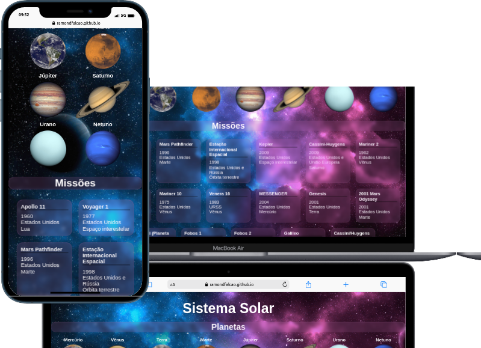

#  <h1 align="center">Projeto Solar System em React!</h1>

# Seja bem-vindo ao meu primeiro projeto em React!

## O que foi desenvolvido

Foi desenvolvido uma aplicação em React que simula uma visualização do Sistema Solar, bem como informações sobre diversas missões espacias que ocorreram ao longo da história.

# Habilidades

Neste projeto, fui capaz de:

- Utilizar JSX no React

- Utilizar corretamente o método render() para renderizar seus componentes

- Utilizar import para trazer componentes em diferentes arquivos
 
- Criar componentes de classe em React

- Criar múltiplos componentes a partir de um array

- Fazer uso de props corretamente

- Fazer uso de PropTypes para validar as props de um componente

## 🛠 Tecnologias

As seguintes ferramentas foram usadas na construção do projeto:

- [ReactJs](https://pt-br.reactjs.org/)
- [Javascript](https://developer.mozilla.org/en-US/docs/Web/JavaScript)
- [Css](https://developer.mozilla.org/en-US/docs/Web/CSS)

## Instruções para abrir a aplicação

[Link Da Aplicação](https://ramondfalcao.github.io/solar-system/)

1. Clone o repositório
  * `git@github.com:ramondfalcao/solar-system.git`
  * Entre na pasta do repositório que você acabou de clonar:
    * `cd solar-system`

2. Instale as dependências e inicialize o projeto
  * Instale as dependências:
    * `npm install`
  * Inicialize o projeto:
    * `npm start` (uma nova página deve abrir no seu navegador)
---
